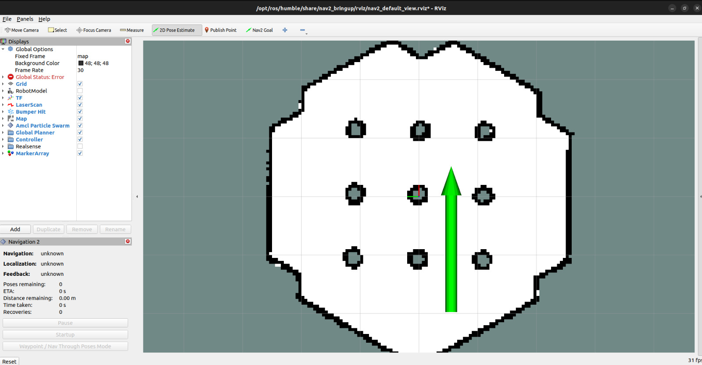

Repeat Guide
================

To follow a path, first ensure that the coordinates from the path demonstration are stored in the `path_saves/your_file.txt` file. This file is also the default file read during the path following process. Make sure you start from the same point where the demonstration began.

1. Navigate to the root of your workspace and source it:

.. code-block:: bash

   cd ~/ros2_ws
   source /opt/ros/humble/setup.bash
   source ./install/setup.bash

2. Launch the navigation system:

.. code-block:: bash

   ros2 launch nav2_bringup tb3_simulation_launch.py headless:=False

3. Open another terminal, navigate to the root of your workspace and source it:

.. code-block:: bash

    cd ~/lognav_ws
    source /opt/ros/humble/setup.bash # Source ROS
    source ./install/setup.bash # Source the workspace

Then, run the path following node:

.. code-block:: bash

    ros2 run teach_and_repeat repeat_bezier_path.py

**Note:** After starting the repeat node, set a pose using `2DPoseEstimate`. The robot will immediately begin following the path.

Like the image below:

Now, you can observe the robot following the path that was demonstrated:

.. image:: images/video_repeat.gif
   :align: center
   :width: 600px
