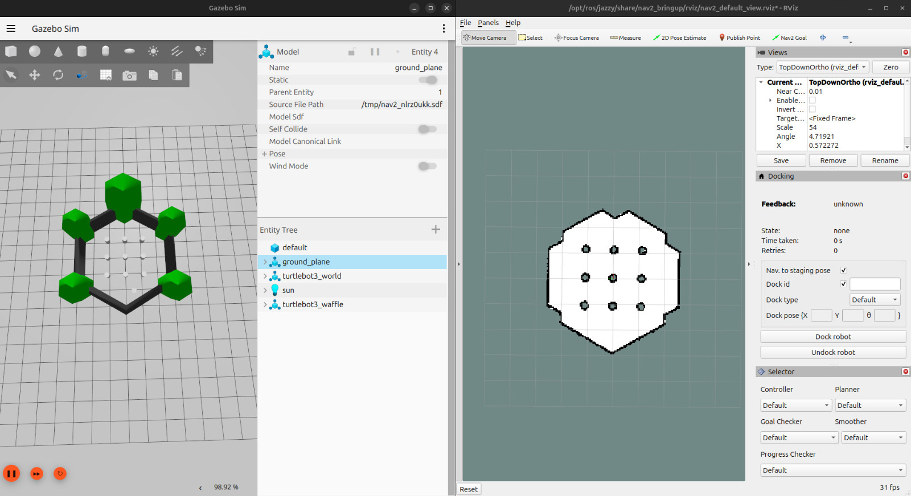

Teach Guide
================

To install the teach package, follow the instructions below and its expected that you already have the turtlebot3 packages installed:

1. Navigate to the root of your workspace and source it:

.. code-block:: bash

   cd ~/ros2_ws
   source /opt/ros/humble/setup.bash
   source ./install/setup.bash

2. Launch the navigation system:

.. code-block:: bash

   ros2 launch nav2_bringup tb3_simulation_launch.py headless:=false

**Note:** Use 'Pose2DEstimation' to define the initial position.

It should look like this:

3. Open another terminal, source the workspace, and start the teach node:

.. code-block:: bash

   ros2 run teach_and_repeat teach_path_coords.py

After that, press `ENTER` to start recording.

4. In another terminal, source the workspace, and start the teleoperation node:

   .. code-block:: bash

      ros2 run teleop_twist_keyboard teleop_twist_keyboard

      #or

      ros2 run teach_and_repeat turtle_teleop.py

**Note:** Now, you can control the robot, it's recommended to make a linear path. (FAZER VIDEO)

5. Save the current path:

In another terminal, source the workspace 'source ./install/setup.bash', and call the service to save the path:

.. code-block:: bash

   ros2 service call /teach_and_repeat/teach/save_path teach_and_repeat/srv/SavePath "{path_name: 'your_path_name'}"

Now, you can close the teleoperation node and the navigation system, and then you can use the saved path for repeating it.

