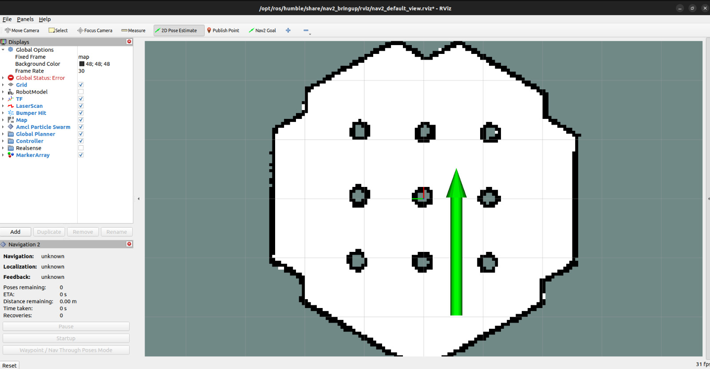

4. Repeat with Nav2 Guide
=========================

Along with the repeat method shown in :ref:`repeat_bezier`, we also make available repeating a path using local (and global, if necessary) planners available in Navigation Stack 2 packages. By using the waypoint following method of navigating, we transform every point from a learned path in a waypoint, thus allowing paths to be repeated using the product-level technology from the Nav2 stack.

Here, we will use the default nav2 parameters as available in the minimal nav2 example with turtlebot3 that we have been using since now, which uses DWB as a local planner and NavFnPlanner as the global planner. These parameters are avaible at the nav2_params.yaml file inside nav2_bringup package. If you followed our tutorial correctly, this file is located at /opt/ros/humble/share/nav2_bringup/params.

Just as before, first ensure that the coordinates from the path demonstration are stored in the `path_saves/your_file.txt` file. This file is also the default file read during the path following process. Make sure you start from the same point where the demonstration began.

.. important::

    As of today, Repeating a path with Nav2 only works if the points learned by the teaching of a path are oriented. This means that, if your path does not have a yaw value, it will not work. We recommend the user to go back to :ref:`teach_guide` to teach a new path.

1. Navigate to the root of your workspace and source it:

.. code-block:: bash

   cd ~/ros2_ws
   source /opt/ros/humble/setup.bash
   source ./install/setup.bash

2. Launch the turtlebot3 simulation and navigation system:

.. code-block:: bash

   ros2 launch nav2_bringup tb3_simulation_launch.py headless:=False

3. Open another terminal, navigate to the root of your workspace and source it:

.. code-block:: bash

    cd ~/lognav_ws
    source /opt/ros/humble/setup.bash # Source ROS
    source ./install/setup.bash # Source the workspace

Then, run the path following node:

.. code-block:: bash

    ros2 run teach_and_repeat navigate_through_poses.py

4. After starting the repeat node, set a pose using `2DPoseEstimate`. The robot will immediately begin following the path.

Like the image below:

Now, you can observe the robot following the path that was demonstrated!
